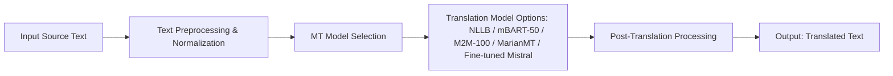
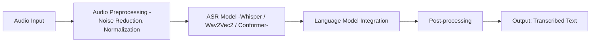

# Tech Watch on Machine Translation System

---

## **1. Introduction**

Develop a modular, scalable, and open-source machine translation system for the Moore language, one of the major languages spoken in Burkina Faso. 

A system with three primary components:
1. **Text-to-Text Translation (MT)**: Translation between French and Moore.
2. **Speech-to-Text (STT)**: Converting spoken French and Moore into text.
3. **Text-to-Speech (TTS)**: Converting translated text into natural-sounding speech in Moore.

Given that Moore is a low-resource language with limited labeled data --> **state-of-the-art (SOTA) deep learning models** while leveraging **fine-tuning, transfer learning, and domain adaptation** techniques.

*Specify*: A lot of monolingual data

Training from scratch
This document attempts to provide a **technical overview** for the selection, adaptation, and deployment of models and discusses key challenges, solutions, and future directions.

---

## **2. Text-to-Text Translation (MT)**

### **2.1. Model Selection**

SOTA models nowadays are focused on **Transformer-based architectures**. They have become the standard in machine translation (MT). 

Interesting options to explore:

- **[mBART-50](https://arxiv.org/abs/2001.08210)** (Facebook AI): A multilingual denoising autoencoder trained on 50 languages, capable of unsupervised translation and adaptation.
- **[M2M-100](https://arxiv.org/abs/2010.11125)** (Facebook AI): A fully multilingual model supporting direct translation between 100 languages without relying on English as an intermediary.
- **[MarianMT / OPUS-MT](https://github.com/Helsinki-NLP/Opus-MT)**: Open-source Transformer models trained on OPUS parallel corpora, well-suited for low-resource languages.
- **[NLLB 200](https://ai.meta.com/research/no-language-left-behind/)**  At scaling machine translation across thousands of language

- **Other interesting option is LLM Lightweight Fine-Tuning – Mistral (https://mistral.ai/)** we can use other models also that are light phi, llama, ....

### **2.2. Benchmarking NLLB Against Previous Models**

#### **Evaluation Criteria:**

- **Model Size and Inference Speed:**  
  - **NLLB**: Although larger than some older models, it has been optimized for scalability and often leverages quantization techniques for faster inference on edge devices.  
  - **MarianMT/OPUS-MT**: Generally lighter in terms of model parameters, which might be beneficial in resource-constrained environments, albeit sometimes at the cost of translation accuracy.
  
- **Adaptability to Low-Resource Languages:**  
  NLLB is designed explicitly with low-resource languages in mind, offering tailored fine-tuning and domain adaptation strategies that give it an edge over more general models like mBART-50 and M2M-100 when applied to Moore.

- **Ease of Integration and Fine-Tuning:**  
  All models support transfer learning and can be fine-tuned on domain-specific data. However, NLLB's architecture incorporates recent advances in multilingual training, potentially reducing the amount of fine-tuning required to achieve high accuracy.

#### **Benchmarking Summary:**

| Model               | BLEU (Low-Resource) | Inference Speed | Model Size   | Adaptability to Moore |
|---------------------|---------------------|-----------------|--------------|-----------------------|
| **NLLB**            | High                | Moderate        | Large (~billions parameters) | Excellent |
| **mBART-50**        | Moderate to High    | Moderate        | Medium       | Not tested                  |
| **M2M-100**         | Moderate            | Moderate        | Medium to Large | Not tested               |
| **MarianMT/OPUS-MT**| Moderate            | Fast            | Small        | Not tested |

### **2.3. Techniques for Improving Translation Performance**

- **Fine-tuning on domain-specific data**: Training models with a curated **French-Moore parallel corpus**.
- **Back-translation** ([Reference](https://arxiv.org/abs/1609.08144)): Generating synthetic Moore-to-French translations to increase training data.
- **Data Augmentation & Denoising**: Introducing noise, paraphrasing, and synthetic data generation to improve robustness.
- **Adapter Layers** ([Reference](https://arxiv.org/abs/1902.00751)): Training lightweight adapter modules to specialize in Moore translation without modifying the entire model.
- **Self Labelling**: Use STT models to transcribe audios

### **2.4. Evaluation Metrics**
- **BLEU Score** ([Reference](https://www.aclweb.org/anthology/P02-1040.pdf)): Measures translation accuracy by comparing model outputs with human translations.
- **CHRF++** ([Reference](https://aclanthology.org/W16-2366.pdf)): A character-based metric useful for morphologically rich languages like Moore.
- **Human Evaluation**: Moore speakers assess fluency and adequacy.

---

## **3. Speech-to-Text (STT) – Automatic Speech Recognition for Moore**

### **3.1. Model Selection**

#### **3.1.1. Whisper (OpenAI) – Pretrained Model Approach**
- **[Whisper](https://openai.com/research/whisper)**: A multilingual ASR model trained on a large and diverse dataset, supporting **Moore transcription** and direct speech translation.
- **Fine-tuning**: We can enhance Whisper’s accuracy on Moore speech by training on additional labeled Moore audio data.

#### **3.1.2. From-Scratch STT Model**
For developing a **custom Moore ASR model**, we consider:

- **Acoustic Modeling**:
  - **[Wav2Vec 2.0](https://arxiv.org/abs/2006.11477)**: Self-supervised speech representation learning.
  - **[Conformer](https://arxiv.org/abs/2005.08100)**: A hybrid convolutional and Transformer-based ASR model.
  
- **Language Modeling**:
  - **Train a Moore-specific language model** using Transformer-based architectures.
  - **Lexicon-based Decoding**: Improves rare word recognition.
  
- **End-to-End Architectures**: Unified models that combine acoustic and language modeling.

### **3.2. Data Collection & Augmentation**
- **Crowdsourced Moore audio datasets**.
- **Synthetic speech data** augmentation.
- **Phonetic-based augmentation** for pronunciation variation coverage.

### **3.3. Evaluation Metrics**
- **Word Error Rate (WER)** – Measures transcription accuracy.
- **Phoneme Error Rate (PER)** – Useful for phonetic consistency.
- **Real-time Factor (RTF)** – Measures inference speed.

---

## **4. Text-to-Speech (TTS) – Speech Synthesis for Moore**

### **4.1. Model Selection**

We consider **neural TTS models** optimized for **low-resource languages**:

- **[Tacotron 2](https://arxiv.org/abs/1712.05884)** (Google) – Sequence-to-sequence model for natural speech synthesis.
- **[FastSpeech 2](https://arxiv.org/abs/2006.04558)** (Microsoft) – Non-autoregressive model for fast inference.
- **[VITS](https://arxiv.org/abs/2106.06103)** – End-to-end model with prosody control.

### **4.2. Techniques for Improvement**
- **Speaker Adaptation**: Fine-tune on **Moore voice datasets**.
- **Prosody & Expressiveness Modeling**: Enhancing pitch and tone variation.
- **Multilingual Pretraining**: Using models trained on **African languages**.
- **Data Augmentation**:
  - Speech perturbation (speed, pitch, noise)
  - Phoneme-based synthesis

### **4.3. Evaluation Metrics**
- **MOS (Mean Opinion Score)** – Human evaluation of naturalness.
- **Mel Cepstral Distortion (MCD)** – Measures synthesized speech quality.
- **CER (Character Error Rate)** – Measures intelligibility.

---

## **5. Pipeline Integration & Deployment**

### **TTT**

### **TTS**

---

## **6. Challenges**

- **Lack of Moore training data** → Data collection & augmentation.
- **Dialectal Variations** → Phonetic modeling techniques.
- **Efficient deployment** → Lightweight models.
- **Multimodal learning** (Text, Audio, Visual cues).

